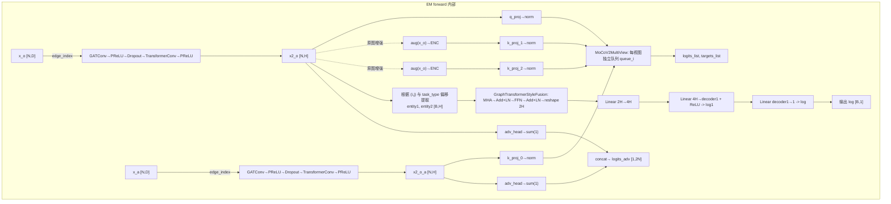
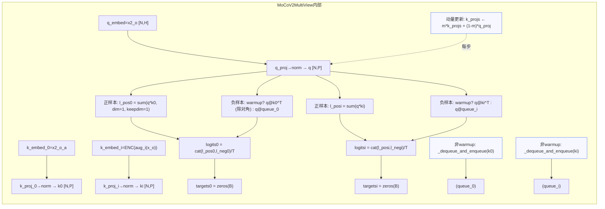
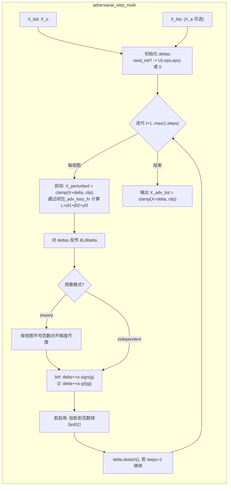

# 项目实现细节总览

本文档基于当前代码实现（model/train.py、layer.py、data_preprocess.py、utils.py、instantiation.py、main.py），系统说明以下内容，并给出工程级数据流、输入输出与参数细节。为聚焦核心实现，刻意排除了参数配置（parms_setting.py）、日志与可视化（log_output_manager.py、visualization.py）等非核心组件。

- 目录
  1) augment_mode 的实现原理、输入输出数据结构  
  2) 对比学习（contrastive learning）的算法细节及在本项目中的应用  
  3) 三种数据增强的具体实现：random_permute_features、attribute_mask、noise_then_mask  
  4) 编码器（encoder）的完整架构说明：网络结构、参数、前向过程、输入输出格式与维度  
  5) 节点级对抗损失与监督学习实现（独立章节）  
  6) 核心数据流图（Mermaid）  
  7) 解码器与融合模块的具体实现与 I/O（独立章节）

---

## 1. augment_mode 的实现原理、输入输出数据结构

实现位置：
- 参数开关：augment_mode（static/online）
- 静态增强：data_preprocess.py::load_data() 内构建 data_a（固定 random_permute_features）
- 在线增强：train.py::train_model() 的每个 batch 动态生成 data_a_aug

核心逻辑：
- 静态模式（static）
  ```python
  # data_preprocess.py
  aug_name = "random_permute_features"
  features_a = apply_augmentation(aug_name, x_o, noise_std=noise_std, mask_rate=mask_rate, seed=base_seed)
  data_a = Data(x=features_a, y=y_a)  # y_a: [N,2]
  ```
- 在线模式（online）
  ```python
  # train.py
  seed_batch = base_seed + epoch*1000 + iter
  aug_x = apply_augmentation("random_permute_features", data_a.x, noise_std=args.noise_std, mask_rate=args.mask_rate, seed=seed_batch)
  data_a_aug = Data(x=aug_x.to(device), y=data_a.y, edge_index=data_a.edge_index)
  ```

对抗训练与 augment_mode 交互：
- adv_mode='mgraph' 且到达 adv_warmup_end 后，_X_list = [data_o.x] + ([data_a_aug.x] if adv_on_moco else [])，多视图分别维护 delta，支持共享/独立预算。

输入输出数据结构：
- 输入：x_o [N,D]，edge_index_o [2,E]
- 输出（静态增强）：data_o=Data(x_o, edge_index)，data_a=Data(features_a, y_a)
- 输出（在线增强）：data_a_aug=Data(aug_x, ...)

随机性与复现：
- 静态 base_seed，在线 seed_batch；对抗 derive_adv_seed(args, fold, epoch, iter)

---

## 2. 对比学习（contrastive learning）的算法细节与应用

实现位置：
- layer.py::MoCoV2MultiView
- 集成：layer.EM.forward() 调用 self.moco(q_embed=x2_o, k_embeds=[x2_o_a, x2_aug1, x2_aug2, ...])

关键流程：
- 多视图构造：第0视图用 x2_o_a；其余对 x_o 应用 ["random_permute_features","attribute_mask","noise_then_mask"] 轮换增强后编码。
- MoCo 计算：
  - q = normalize(q_proj(x2_o)); k_i = normalize(k_proj_i(k_embed_i))
  - logits_i = cat([q·k_i, q @ queue_i], dim=1) / T；targets_i = zeros(B)
  - loss2 = mean_i CrossEntropy(logits_i, targets_i)
- 队列与动量键：每视图独立队列与指针；k 编码器动量更新；queue_warmup_steps 控制是否用队列

---

## 3. 数据增强实现（utils.py）

统一入口：
```python
aug_x = apply_augmentation(name, X, noise_std=args.noise_std, mask_rate=args.mask_rate, seed=seed_v)
```

- random_permute_features：行置乱
  ```python
  idx = torch.randperm(N, generator=g); out = X.index_select(0, idx)
  ```
- attribute_mask：按列掩蔽 k=int(mask_rate*D) 个特征列为 0
- noise_then_mask：先 add_noise(std=noise_std)，再 attribute_mask

---

## 4. 编码器（encoder）架构（layer.py::GATGTSerial）

网络结构：
- GATConv(in_dim → hidden1*heads, heads=args.gat_heads, dropout=args.dropout) → PReLU
- Dropout(p=args.dropout)
- TransformerConv(hidden1*heads → hidden2, heads=1, concat=False, dropout=args.dropout) → PReLU

前向：
```python
x1 = PReLU(GATConv(x, edge_index)); x1 = dropout(x1)
x2 = PReLU(TransformerConv(x1, edge_index))
return x2  # [N, hidden2]
```

输入/输出：
- 输入 x [N,D]，edge_index [2,E]
- 输出 x2 [N, hidden2]

---

# 5. 节点级对抗损失与监督学习实现（独立章节）

## 5.1 节点级对抗损失（adv_loss）

定义与语义：
- EM.forward() 用 adv_head 对 x2_o、x2_o_a 线性映射并沿特征维求和，拼接得到 logits_adv [1,2N]
- 训练中用 BCEWithLogitsLoss(logits_adv, lbl2)，其中 lbl2=[1×N, 0×N]
- 语义：原图节点判为正、增强/扰动图节点判为负；用于常规训练与对抗闭环目标

实现要点（代码级）：
```python
# layer.EM.forward()
sc_1 = self.adv_head(x2_o).sum(1).unsqueeze(0)      # [1,N]
sc_2 = self.adv_head(x2_o_a).sum(1).unsqueeze(0)    # [1,N]
logits_adv = torch.cat((sc_1, sc_2), dim=1)         # [1,2N]
```
```python
# train.py / test()
n = data_o.x.size(0)
lbl2 = torch.cat((torch.ones(1,n,device=device), torch.zeros(1,n,device=device)), dim=1)
l3 = BCEWithLogitsLoss()(logits_adv, lbl2.float())
```

总损失与对抗闭环：
```python
# 总损失
loss = α*l1 + β*l2 + γ*l3
# 闭包用于PGD/FGSM
def _adv_loss_fn(X_list):
    out, cos, cos_a, _, lgts, _ = model(...)
    l1 = BCE(sigmoid(out), label)
    l2 = CE(cos, cos_a)
    l3 = BCEWithLogits(lgts, lbl2)
    return α*l1 + β*l2 + γ*l3
X_adv = adversarial_step_multi(_X_list, _adv_loss_fn, args)
```

PGD/FGSM 内核（layer.py）：
- 输入：X_list=[X_o,(X_a)], cfg：adv_norm(linf/l2), adv_eps, adv_alpha, adv_steps, adv_rand_init, adv_project, adv_budget(shared/independent), adv_clip_min/max
- 步骤：初始化 delta → 迭代前向/反传 → linf: d+=α·sign(g)；l2: d+=α·g/||g|| → 投影到范数球 → 裁剪 → 得到 X_adv
- 数学式：
  - L_total = α·BCE(sigmoid(output), y) + β·CE(cla_os, cla_os_a) + γ·BCEWithLogits(logits_adv, lbl2)
  - FGSM: x_adv = clamp(x + eps·sign(∇_x L_total))
  - PGD: d_{t+1} = Π_{||·||≤eps}( d_t + α·u(∇_d L_total) )

输入/输出数据结构：
- logits_adv: [1,2N]；lbl2: [1,2N]；l3: 标量
- adversarial_step_multi：输入 X_list（每项[N,D]），输出同结构的 X_adv_list（裁剪到 [clip_min, clip_max]）

应用场景：
- 常规：未启用 PGD 或未过 warmup，直接计算 l3
- 对抗：adv_mode='mgraph' 且 epoch≥adv_warmup_end，l3 同时参与对抗目标与最终训练目标
- 可同时扰动原图与 MoCo 视图（adv_on_moco），预算 shared/independent，支持 AMP

## 5.2 监督学习实现

数据预处理与折分（data_preprocess.load_data）：
- 正/负样本构建与 5 折；训练折重算相似度 → 异构邻接 → 拉普拉斯归一化
- edge_index = adj.nonzero()；features_o 按 feature_type 生成并 normalize
- 增强视图：静态 random_permute_features 或训练期在线增强
- 输出：data_o=Data(x_o, edge_index)，data_a=Data(features_a, y_a)；DataLoader 产出 (label, (entity1, entity2))

模型结构（layer.EM）：
- 编码器：GATConv → Dropout → TransformerConv → PReLU
- 图读出：AvgReadout + MLP（输出 log1 辅助）
- MoCo：第0视图 x2_o_a，其余原图增强视图；输出对比 logits/targets
- 融合解码：两 token 注意力+前馈 → 线性输出主任务 log
- 节点级对抗：adv_head → sum → logits_adv [1,2N]
- forward 返回：(log, cla_os, cla_os_a, x2_o, logits_adv, log1)

训练流程（train.train_model）：
- 每 batch：可选在线增强 → 可选对抗生成 → 前向
  - l1 = BCE(sigmoid(output), label)
  - l2 = CE(cla_os, cla_os_a)（多视图取均值）
  - l3 = BCEWithLogits(logits_adv, lbl2)
  - loss = αl1 + βl2 + γl3 → backward/step
- 验证：test() 评估 val_loss/val_auroc，写入 CSV
- 测试：输出 y_true/pred/logit、阈值扫描、温度缩放等

输入/输出张量形状：
- Data.x: [N,D]；edge_index: [2,E]
- Batch：label [B]，inp=(i_idx, j_idx)
- forward：log [B,1]，cla_os Tensor|List[Tensor]，x2_o [N,H]，logits_adv [1,2N]，log1 [B,decoder1]
- 损失：l1/l2/l3 标量；loss 标量

---

## 6. 核心数据流图（Mermaid）

下图基于当前代码实现，覆盖核心路径：数据加载/增强、训练循环、可选对抗、编码与多视图 MoCo、融合解码与三项损失。严格排除参数/日志/绘图模块。

### 6.1 总体数据流（从数据到三损失与优化）



说明：
- H=hidden2；V=num_views（由 args.num_views，默认≥1）。
- targets_i 恒为 0（正样本为第0列，即 q·k_i）。
- lbl2=[1×N, 0×N]（原/增强节点二分类标签）。

### 6.2 模型内部前向细化（编码→MoCo→解码→对抗分支）


### 6.3 MoCo 视图与队列机制细化



注：
- P=proj_dim（args.proj_dim，若未设默认为 H）。
- queue_warmup_steps>global_step 时使用同批内相似度构造负样本；否则使用队列。
- 目标 targets 恒为 0，匹配 logits 第0列的正样本位置。

### 6.4 对抗生成（PGD/FGSM）内核细化



闭包 _adv_loss_fn 接口（与 train.py 一致）：
- 接收按视图顺序排列的扰动后特征列表，构造 Data(x, edge_index) 送入 model
- 计算：
  - l1 = BCE(sigmoid(log), label)
  - l2 = CE(cla_os, cla_os_a)（若开启）
  - l3 = BCEWithLogits(logits_adv, lbl2)
  - L = αl1 + βl2 + γl3

---

## 7. 解码器与融合模块的具体实现与 I/O（layer.py）

本节详细说明 GraphTransformerStyleFusion 与 FusionDecoder 的内部结构、前向计算以及输入/输出数据格式。

### 7.1 GraphTransformerStyleFusion（两-token 注意力融合）

实现位置：layer.py::GraphTransformerStyleFusion

结构组成：
- MultiheadAttention：embed_dim=hidden_dim，num_heads=heads（默认4），dropout
- 前馈网络 FFN：Linear(hidden_dim → 4×hidden_dim) → ReLU → Dropout → Linear(4×hidden_dim → hidden_dim)
- 残差与归一化：LayerNorm 两次，配合 Dropout 形成两段残差
- 输出展平：将长度为2的序列在通道维拼接，得到 [B, 2H]

前向流程（关键代码）：
```python
def forward(self, e1, e2):
    B, H = e1.size(0), e1.size(1)
    x = torch.stack([e1, e2], dim=1)          # [B,2,H]
    attn_out, _ = self.mha(x, x, x)           # 自注意力 [B,2,H]
    x = self.norm1(x + self.dropout(attn_out))
    ffn_out = self.ffn(x)                     # [B,2,H]
    x = self.norm2(x + self.dropout(ffn_out)) # [B,2,H]
    x = x.reshape(B, 2 * H)                   # 展平为 [B,2H]
    return x
```

输入/输出：
- 输入 e1, e2：两实体的节点级表示，形状 [B, H]（H=hidden2）
  - 来源：EM.forward 内根据 task_type 从 x2_o 索引得到 entity1/2
- 输出：融合后的向量 [B, 2H]，用于解码器后续线性层

注意：
- heads 与 dropout 由 FusionDecoder 的构造入参传入（默认 heads=4，dropout=模型全局 dropout）
- 使用 batch_first=True 的 MHA，输入序列维在 dim=1

### 7.2 FusionDecoder（融合 + 解码为主任务 logit）

实现位置：layer.py::FusionDecoder

结构组成：
- strategy：GraphTransformerStyleFusion(hidden_dim, heads, dropout)
- proj4h：Linear(2H → 4H)，升维以增强表达
- fc1：Linear(4H → decoder1)，中间层 log1（激活 ReLU）
- fc2：Linear(decoder1 → 1)，输出二分类 logit（未 Sigmoid）

前向流程（关键代码）：
```python
def forward(self, e1, e2):
    feat2h = self.strategy(e1, e2)   # [B,2H]
    fused4h = self.proj4h(feat2h)    # [B,4H]
    log1 = F.relu(self.fc1(fused4h)) # [B,decoder1]
    log = self.fc2(log1)             # [B,1]
    return log, log1
```

输入/输出：
- 输入 e1, e2：[B, H]，分别为两实体在共享编码器后的表示（见 7.3）
- 输出：
  - log：[B, 1]，主任务二分类的未归一化 logit，训练中用 Sigmoid 后计算 BCE
  - log1：[B, decoder1]，中间特征，仅作为辅助表征返回，不直接参与损失

### 7.3 解码器输入的构造（实体索引选择）

实现位置：layer.py::EM.forward（实体抽取段）

根据任务类型（args.task_type）对 x2_o 的行索引进行偏移，得到两实体 embedding：
```python
if args.task_type == 'LDA':
    entity1 = x2_o[idx[0]]
    entity2 = x2_o[idx[1] + 240]
elif args.task_type == 'MDA':
    entity1 = x2_o[idx[0] + 645]
    entity2 = x2_o[idx[1] + 240]
elif args.task_type == 'LMI':
    entity1 = x2_o[idx[0]]
    entity2 = x2_o[idx[1] + 645]
else:
    entity1 = x2_o[idx[0]]
    entity2 = x2_o[idx[1]]
```
- idx 为 DataLoader 提供的 (i_idx, j_idx)
- 偏移常数（如 240、645）对应不同实体类型在拼接图中的起始位置
- 输出 entity1、entity2 形状均为 [B, H]

### 7.4 解码器在训练与损失中的位置关系

- 解码器输出 log 被 Sigmoid 后与 batch 标签 label 计算主任务损失 l1：
  ```python
  log = torch.squeeze(Sigmoid(output))  # output 即 log
  l1 = BCELoss()(log, label.float())
  ```
- FusionDecoder 的 log1 不直接参与损失，但被返回用于可视化或调试
- 解码器与其输入的融合模块共同构成主任务预测路径，与 MoCo 对比学习与节点级对抗损失并行，最终以
  ```
  loss_total = α*l1 + β*l2 + γ*l3
  ```
  融合反传与优化